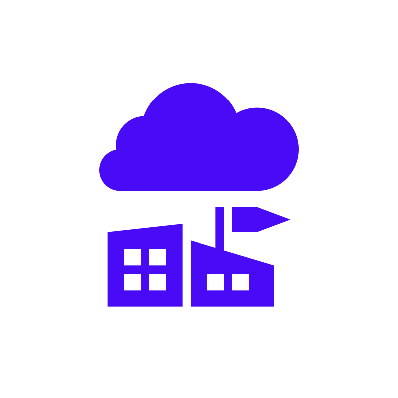
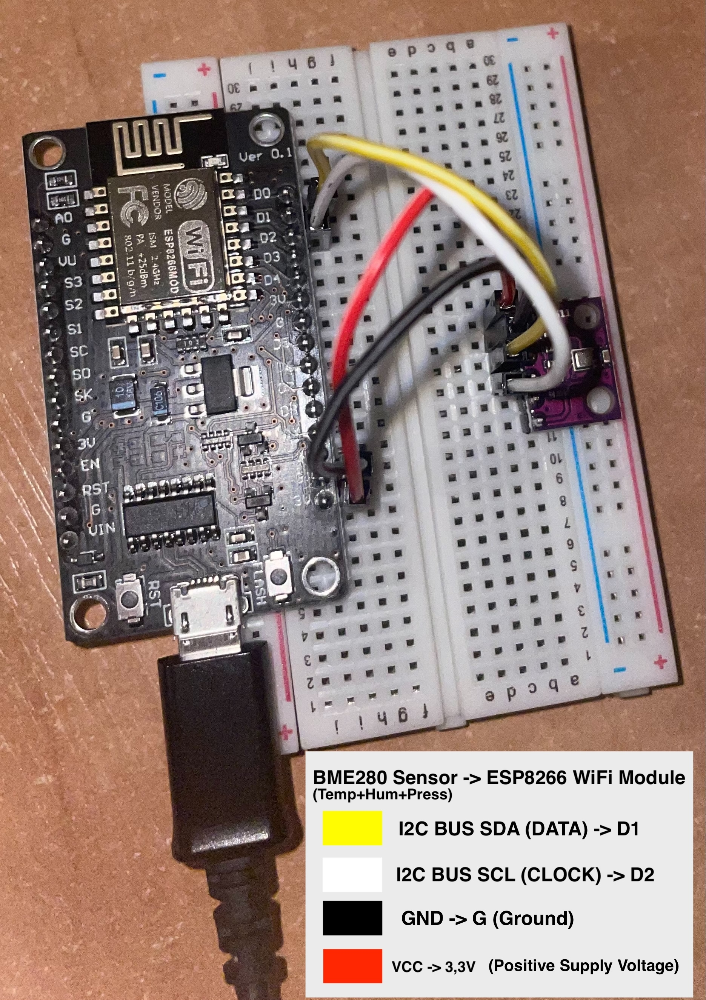
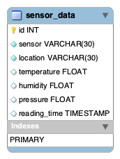

<a name="readme-top"></a>

[![Contributors][contributors-shield]][contributors-url]
[![Forks][forks-shield]][forks-url]
[![Stargazers][stars-shield]][stars-url]
[![Issues][issues-shield]][issues-url]
[![MIT License][license-shield]][license-url]
[![LinkedIn][linkedin-shield]][linkedin-url]

<!-- PROJECT LOGO -->
<br />
<div align="center">
  <a href="https://github.com/MateuszKrolik/Weather_Station">
    
  </a>

<h3 align="center">Weather Station</h3>
  <p align="center">
    <br />
    <a href="https://github.com/MateuszKrolik/Weather_Station"><strong>Explore the docs »</strong></a>
    <br />
    <br />
    <a href="https://github.com/MateuszKrolik/Weather_Station">View Demo</a>
    ·
    <a href="https://github.com/MateuszKrolik/Weather_Station/issues">Report Bug</a>
    ·
    <a href="https://github.com/MateuszKrolik/Weather_Station/issues">Request Feature</a>
  </p>
</div>

<!-- TABLE OF CONTENTS -->
<details>
  <summary>Table of Contents</summary>
  <ol>
    <li>
      <a href="#about-the-project">About The Project</a>
      <ul>
        <li><a href="#built-with">Built With</a></li>
      </ul>
    </li>
    <li>
      <a href="#getting-started">Getting Started</a>
      <ul>
        <li><a href="#installation">Installation</a></li>
      </ul>
    </li>
    <li><a href="#usage">Usage</a></li>
    <li><a href="#roadmap">Roadmap</a></li>
    <li><a href="#contributing">Contributing</a></li>
    <li><a href="#license">License</a></li>
    <li><a href="#contact">Contact</a></li>
    <li><a href="#acknowledgments">Acknowledgments</a></li>
  </ol>
</details>

<!-- ABOUT THE PROJECT -->

## About The Project

### Click below gif to open the WebSite 😁

#### PS. I changed the API_KEY_VALUE logged to the below Arduino IDE Serial Monitor right after recording this video, so don't worry about security, it's there! 😉

[![Product Name Screen Shot][product-screenshot]](https://mkrolik-weather-station-cd6128b-577vxatqwa-ew.a.run.app/)

### BME280 Sensor + ESP8266 WiFi Module BreadBoard Circuit 🙂



### MySQL/SQLAlchemy Schema Visualization 😁 (MySQL WorkBench Reverse-Engineering)



<p align="right">(<a href="#readme-top">back to top</a>)</p>

### Built With

<!-- Primary Technologies -->

- [![MVC][MVC]][MVC-url]
- [![Arduino][Arduino]][Arduino-url]

<!-- Programming Languages -->

- [![C][C]][C-url]
- [![C++][C++]][C++-url]
- [![Python][Python]][Python-url]
- [![JavaScript][JavaScript]][JavaScript-url]

<!-- Web Technologies -->

- [![Flask][Flask]][Flask-url]
- [![Jinja2][Jinja2]][Jinja2-url]
- [![jQuery][jQuery]][jQuery-url]
- [![Gunicorn][Gunicorn]][Gunicorn-url]
- [![HTML5][HTML5]][HTML5-url]
- [![CSS3][CSS3]][CSS3-url]

<!-- Database Technologies -->

- [![SQLAlchemy][SQLAlchemy]][SQLAlchemy-url]
- [![MySQL][MySQL]][MySQL-url]
- [![SQLite][SQLite]][SQLite-url]
- [![SQL][SQL]][SQL-url]

<!-- Testing and Version Control -->

- [![Pytest][Pytest]][Pytest-url]
- [![JUnit][JUnit]][JUnit-url]
- [![GitHub Actions][GitHub Actions]][GitHub Actions-url]

<!-- Containerization -->

- [![Docker][Docker]][Docker-url]
- [![Linux/Unix][Linux/Unix]][Linux/Unix-url]
- [![Bash][Bash]][Bash-url]

<!-- Cloud Technologies -->

- [![GCP Compute Engine][GCP Compute Engine]][GCP Compute Engine-url]
- [![GCP Cloud Build][GCP Cloud Build]][GCP Cloud Build-url]
- [![GCP Artifact Registry][GCP Artifact Registry]][GCP Artifact Registry-url]
- [![GCP Cloud Run][GCP Cloud Run]][GCP Cloud Run-url]
- [![GCP Cloud SQL][GCP Cloud SQL]][GCP Cloud SQL-url]
- [![Google Cloud Platform][Google Cloud Platform]][Google Cloud Platform-url]
- [![Google Cloud Storage][Google Cloud Storage]][Google Cloud Storage-url]
- [![GCP Secret Manager][GCP Secret Manager]][GCP Secret Manager-url]
- [![GCP IAM][GCP IAM]][GCP IAM-url]

<!-- Data Formats -->

- [![YAML][YAML]][YAML-url]
- [![XML][XML]][XML-url]
- [![JSON][JSON]][JSON-url]
- [![.env][.env]][.env-url]

<!-- IDEs and Editors -->

- [![VSCode][VSCode]][VSCode-url]
- [![Anaconda][Anaconda]][Anaconda-url]

<!-- Other Technologies -->

- [![FFmpeg][FFmpeg]][FFmpeg-url]

<p align="right">(<a href="#readme-top">back to top</a>)</p>

<!-- GETTING STARTED -->

## Getting Started

As a prerequisite i recommend having VScode, Python3 and Anaconda Navigator (For Python Virtual Environments Management) installed, as well as Docker for Desktop.

For a Smooth DataBase management experience also consider using MySQL WorkBench.

### Installation

1. Clone the repo
   ```sh
   git clone https://github.com/MateuszKrolik/Weather_Station.git
   ```
2. Install Build Image w/ Docker-Compose
   ```sh
   docker-compose up --build
   ```
3. Enter your environment variables in `.env` and `GCP Secret Manager`.
   ```sh
   API_KEY_VALUE = "ENTER YOUR API_KEY_VALUE";
   SQLALCHEMY_DATABASE_URI = "ENTER YOUR SQLALCHEMY_DATABASE_URI";
   DEBUG = "ENTER YOUR DEBUG";
   PORT = "ENTER YOUR PORT";
   ```
4. When deploying remember to create a GitHub master branch trigger in GCP Cloud Build, and don't forget to set all the necessary IAM Roles

<p align="right">(<a href="#readme-top">back to top</a>)</p>

<!-- USAGE EXAMPLES -->

## Usage

_Below you'll find visual usage example representation if form of videos.
To test these out yourself visit this [Link](https://mkrolik-weather-station-cd6128b-577vxatqwa-ew.a.run.app/) 😉_

https://github.com/MateuszKrolik/Weather_Station/assets/127691471/d18b9f88-3dbb-4262-a711-e40395bb4325

### PS. I changed the API_KEY_VALUE logged to the below Arduino IDE Serial Monitor right after recording this video, so don't worry about security, it's there! 😉

https://github.com/MateuszKrolik/Weather_Station/assets/127691471/e26560c6-0a08-4906-9ffe-0670d175656b

<p align="right">(<a href="#readme-top">back to top</a>)</p>

<!-- ROADMAP -->

## Roadmap

- [x] Weather Station BreadBoard Circuit and Arduino Sketch via:
  - [x] ESP8266 WiFi Module Board
  - [x] BME280 Temp, Hum & Press Sensor
  - [x] I2C Bus
  - [x] Arduino IDE
  - [x] C/C++ Languages
  - [x] Adafruit+BME280 Libraries
- [x] Monolithic Architecture: Model-View-Controller (MVC)
- [x] Containerization via Docker and Docker-Compose
- [x] Design Patterns (Application Factory)
- [x] Python3 Flask Web Framework
- [x] Python3 Gunicorn Production WebServer
- [x] Anaconda Navigator Python3 Virtual Environment Management
- [x] Jinja2 Dynamic HTML Templating Engine
- [x] JavaScript+JQuery Responsive Temperature and Humidity Gauges
- [x] Cross-Origin-Resource-Sharing(CORS)
- [x] Hosted GCP Cloud SQL MySQL DataBase Instance
- [x] Create-Read-Update-Delete (CRUD) Functionality
- [x] SQLAlchemy Object-Relational-Mapper (ORM)
- [x] Test-Driven-Development(TDD) - Unit and Integration via:
  - [x] PyTest
  - [x] SQLite In-Memory Mock Database
- [x] Visualized MySQL Schema (WorkBench Reverse-Engineering Feature)
- [x] Error Handling
- [x] Environment Variables for Securing Sensitive Data
- [x] SSL/TLS Encryption
- [x] Object Storage (Google Cloud Storage)
- [x] Multithreading
- [x] Infrastructure-as-Code (IaC) via CloudBuild YAML file
- [x] Infrastracture-as-a-Service (IaaS) via GCP Compute Engine + SSH Protocol + DockerEngine + MySQL
- [x] Automatized Dockerized CI/CD&IaC Serverless Deployment via:
  - [x] GitHub Master Branch Commit Trigger
  - [x] GCP Cloud Build (IaC & CI/CD)
  - [x] GCP Cloud Run (FaaS/PaaS)
  - [x] GCP Artifact Registry
  - [x] GCP Cloud Storage for JUnit XML PyTest Logs
  - [x] GCP Secret Manager (.ENV)
  - [x] GCP IAM Roles (Least Priveleged Principle)
- [x] Best Practices
- [x] CSS3 Media Query Mobile Responsiveness
- [x] FFmpeg for Video-to-GIF Conversion

See the [open issues](https://github.com/MateuszKrolik/Weather_Station/issues) for a full list of proposed features (and known issues).

<p align="right">(<a href="#readme-top">back to top</a>)</p>

<!-- CONTRIBUTING -->

## Contributing

Contributions are what make the open source community such an amazing place to learn, inspire, and create. Any contributions you make are **greatly appreciated**.

If you have a suggestion that would make this better, please fork the repo and create a pull request. You can also simply open an issue with the tag "enhancement".
Don't forget to give the project a star! Thanks again!

1. Fork the Project
2. Create your Feature Branch (`git checkout -b feature/AmazingFeature`)
3. Commit your Changes (`git commit -m 'Add some AmazingFeature'`)
4. Push to the Branch (`git push origin feature/AmazingFeature`)
5. Open a Pull Request

<p align="right">(<a href="#readme-top">back to top</a>)</p>

<!-- LICENSE -->

## License

Distributed under the MIT License. See `LICENSE` for more information.

<p align="right">(<a href="#readme-top">back to top</a>)</p>

<!-- CONTACT -->

## Contact

Mateusz Królik - [Mateusz Królik](https://www.linkedin.com/in/mateusz-kr%C3%B3lik-8b1862262/) - [mateuszkrolik87@gmail.com](mailto:mateuszkrolik7@gmail.com)

Project Link: [Project Link](https://mkrolik-weather-station-cd6128b-577vxatqwa-ew.a.run.app/)

GitHub Repository Link: [GitHub Repository Link](https://github.com/MateuszKrolik/Weather_Station)

<p align="right">(<a href="#readme-top">back to top</a>)</p>

<!-- ACKNOWLEDGMENTS -->

## Acknowledgments

- [Img Shields](https://shields.io)
- [GitHub Emoji Cheat Sheet](https://www.webpagefx.com/tools/emoji-cheat-sheet)
- [Malven's Flexbox Cheatsheet](https://flexbox.malven.co/)
- [Malven's Grid Cheatsheet](https://grid.malven.co/)
- [SVG Repo](https://www.svgrepo.com/)

<p align="right">(<a href="#readme-top">back to top</a>)</p>

<!-- MARKDOWN LINKS & IMAGES -->
<!-- https://www.markdownguide.org/basic-syntax/#reference-style-links -->

[contributors-shield]: https://img.shields.io/github/contributors/MateuszKrolik/EXPRESS-SHOP.svg?style=for-the-badge
[contributors-url]: https://github.com/MateuszKrolik/Weather_Station/graphs/contributors
[forks-shield]: https://img.shields.io/github/forks/MateuszKrolik/EXPRESS-SHOP.svg?style=for-the-badge
[forks-url]: https://github.com/MateuszKrolik/Weather_Station/network/members
[stars-shield]: https://img.shields.io/github/stars/MateuszKrolik/EXPRESS-SHOP.svg?style=for-the-badge
[stars-url]: https://github.com/MateuszKrolik/Weather_Station/stargazers
[issues-shield]: https://img.shields.io/github/issues/MateuszKrolik/EXPRESS-SHOP.svg?style=for-the-badge
[issues-url]: https://github.com/MateuszKrolik/Weather_Station/issues
[license-shield]: https://img.shields.io/github/license/MateuszKrolik/EXPRESS-SHOP.svg?style=for-the-badge
[license-url]: https://github.com/MateuszKrolik/Weather_Station/blob/master/LICENSE
[linkedin-shield]: https://img.shields.io/badge/-LinkedIn-black.svg?style=for-the-badge&logo=linkedin&colorB=555
[linkedin-url]: https://linkedin.com/in/mateusz-królik-8b1862262
[product-screenshot]: images/screenshot.gif
[Docker]: https://img.shields.io/badge/Docker-2CA5E0?style=for-the-badge&logo=docker&logoColor=white
[Docker-url]: https://www.docker.com/
[Linux/Unix]: https://img.shields.io/badge/Linux-FCC624?style=for-the-badge&logo=linux&logoColor=black
[Linux/Unix-url]: https://www.linux.org/
[JavaScript]: https://img.shields.io/badge/JavaScript-F7DF1E?style=for-the-badge&logo=javascript&logoColor=black
[JavaScript-url]: https://www.javascript.com/
[Google Cloud Platform]: https://img.shields.io/badge/Google_Cloud-4285F4?style=for-the-badge&logo=google-cloud&logoColor=white
[Google Cloud Platform-url]: https://cloud.google.com/
[Google Cloud Storage]: https://img.shields.io/badge/Google_Cloud_Storage-4285F4?style=for-the-badge&logo=googlecloudstorage&logoColor=white
[Google Cloud Storage-url]: https://cloud.google.com/storage
[HTML5]: https://img.shields.io/badge/HTML5-E34F26?style=for-the-badge&logo=html5&logoColor=white
[HTML5-url]: https://www.w3.org/html/
[CSS3]: https://img.shields.io/badge/CSS3-1572B6?style=for-the-badge&logo=css3&logoColor=white
[CSS3-url]: https://www.w3.org/Style/CSS/Overview.en.html
[Bash]: https://img.shields.io/badge/Bash-4EAA4B?style=for-the-badge&logo=gnu-bash&logoColor=white
[Bash-url]: https://www.gnu.org/software/bash/
[Arduino]: https://img.shields.io/badge/Arduino-00979D?style=for-the-badge&logo=arduino&logoColor=white
[Arduino-url]: https://www.arduino.cc/
[C]: https://img.shields.io/badge/C-A8B9CC?style=for-the-badge&logo=c&logoColor=white
[C-url]: https://en.wikipedia.org/wiki/C_(programming_language)
[C++]: https://img.shields.io/badge/C++-00599C?style=for-the-badge&logo=cplusplus&logoColor=white
[C++-url]: https://en.wikipedia.org/wiki/C%2B%2B
[Python]: https://img.shields.io/badge/Python-3776AB?style=for-the-badge&logo=python&logoColor=white
[Python-url]: https://www.python.org/
[Flask]: https://img.shields.io/badge/Flask-000000?style=for-the-badge&logo=flask&logoColor=white
[Flask-url]: https://flask.palletsprojects.com/
[Pytest]: https://img.shields.io/badge/Pytest-0A9EDC?style=for-the-badge&logo=pytest&logoColor=white
[Pytest-url]: https://docs.pytest.org/
[SQLAlchemy]: https://img.shields.io/badge/SQLAlchemy-8C2D19?style=for-the-badge&logo=sqlalchemy&logoColor=white
[SQLAlchemy-url]: https://www.sqlalchemy.org/
[MySQL]: https://img.shields.io/badge/MySQL-4479A1?style=for-the-badge&logo=mysql&logoColor=white
[MySQL-url]: https://www.mysql.com/
[SQLite]: https://img.shields.io/badge/SQLite-003B57?style=for-the-badge&logo=sqlite&logoColor=white
[SQLite-url]: https://www.sqlite.org/
[SQL]: https://img.shields.io/badge/SQL-4479A1?style=for-the-badge&logo=data:image/svg+xml;base64,PHN2ZyB4bWxucz0iaHR0cDovL3d3dy53My5vcmcvMjAwMC9zdmciIHhtbG5zOnhsaW5rPSJodHRwOi8vd3d3LnczLm9yZy8xOTk5L3hsaW5rIiB2aWV3Qm94PSIwIDAgNjEgODEiIGZpbGw9IiNmZmYiIGZpbGwtcnVsZT0iZXZlbm9kZCIgc3Ryb2tlPSIjMDAwIiBzdHJva2UtbGluZWNhcD0icm91bmQiIHN0cm9rZS1saW5lam9pbj0icm91bmQiPjx1c2UgeGxpbms6aHJlZj0iI0EiIHg9Ii41IiB5PSIuNSIvPjxzeW1ib2wgaWQ9IkEiIG92ZXJmbG93PSJ2aXNpYmxlIj48ZyBmaWxsPSIjMDA3MmM2IiBzdHJva2U9Im5vbmUiPjxwYXRoIGQ9Ik0wIDEwLjkyOXY1OC4xNEMwIDc1LjEwNiAxMy40MzIgODAgMzAgODBWMTAuOTI5SDB6Ii8+PHVzZSB4bGluazpocmVmPSIjQyIvPjwvZz48dXNlIHhsaW5rOmhyZWY9IiNDIiBvcGFjaXR5PSIuMTUiIHN0cm9rZT0ibm9uZSIvPjxwYXRoIGQ9Ik02MCAxMC45MjljMCA2LjAzNi0xMy40MzIgMTAuOTI5LTMwIDEwLjkyOVMwIDE2Ljk2NSAwIDEwLjkyOSAxMy40MzIgMCAzMCAwczMwIDQuODkzIDMwIDEwLjkyOSIgc3Ryb2tlPSJub25lIi8+PHBhdGggZD0iTTUzLjg2NiAxMC4yOTljMCAzLjk4NS0xMC42ODUgNy4yMTEtMjMuODY2IDcuMjExUzYuMTMyIDE0LjI4NCA2LjEzMiAxMC4yOTkgMTYuODE5IDMuMDg4IDMwIDMuMDg4czIzLjg2NiAzLjIyOCAyMy44NjYgNy4yMTEiIGZpbGw9IiM3ZmJhMDAiIHN0cm9rZT0ibm9uZSIvPjxwYXRoIGQ9Ik00OC44NjcgMTQuNzA3YzMuMTI0LTEuMjE5IDUuMDAyLTIuNzQ1IDUuMDAyLTQuNDA0QzUzLjg2OCA2LjMxOCA0My4xODMgMy4wOSAzMCAzLjA5UzYuMTM0IDYuMzE4IDYuMTM0IDEwLjMwM2MwIDEuNjU4IDEuODc3IDMuMTg1IDUuMDAyIDQuNDA0IDQuMzYzLTEuNzA0IDExLjE4Mi0yLjgwMyAxOC44NjUtMi44MDNzMTQuNSAxLjA5OSAxOC44NjYgMi44MDMiIGZpbGw9IiNiOGQ0MzIiIHN0cm9rZT0ibm9uZSIvPjxwYXRoIGQ9Ik0yMC40NzIgNTEuMjg3YzAgMS44MDctLjY1MSAzLjIwNi0xLjk1NSA0LjE5N3MtMy4xMDIgMS40ODgtNS4zOTkgMS40ODhjLTEuOTU0IDAtMy41ODctLjM1NC00Ljg5OS0xLjA2M3YtNC4yNTFjMS41MTQgMS4yOTMgMy4xODIgMS45NCA1LjAwNCAxLjk0Ljg4IDAgMS41NjEtLjE3NyAyLjA0MS0uNTMycy43Mi0uODIzLjcyLTEuNDA5YzAtLjU3NS0uMjMxLTEuMDc1LS42OTMtMS41cy0xLjQwMi0uOTc0LTIuODE5LTEuNjQ3Yy0yLjg4OC0xLjM2Mi00LjMzMS0zLjIyNC00LjMzMS01LjU3NyAwLTEuNzA4LjYyOS0zLjA3OCAxLjg4OS00LjExczIuOTMxLTEuNTQ3IDUuMDE2LTEuNTQ3YzEuODQ5IDAgMy4zNzkuMjQ1IDQuNTk2LjczMXYzLjk3MWMtMS4yNzYtLjg4Ni0yLjcyOS0xLjMyOC00LjM1Ny0xLjMyOC0uODE4IDAtMS40NjUuMTc0LTEuOTQuNTIzYTEuNjUgMS42NSAwIDAgMC0uNzEyIDEuNDAxYzAgLjYwMi4xOTEgMS4wOTYuNTc1IDEuNDgxczEuMTY4Ljg2MSAyLjM1NiAxLjQyOGMxLjc3Ljg0MiAzLjAzIDEuNjk1IDMuNzg0IDIuNTYzczEuMTI1IDEuOTUgMS4xMjUgMy4yNDF6bTIwLjM3LTQuMzAyYzAgMi4yNC0uNTA3IDQuMTg1LTEuNTE5IDUuODNzLTIuNDM4IDIuODAxLTQuMjc3IDMuNDY2bDUuNDkxIDUuMTEzaC01LjU0NGwtMy45MjEtNC40MjNjLTEuNjgxLS4wNjEtMy4xOTgtLjUwOS00LjU0OS0xLjM0MXMtMi4zOTUtMS45NzItMy4xMjktMy40Mi0xLjEwMy0zLjA2Mi0xLjEwMy00Ljg0MWMwLTEuOTc0LjM5OC0zLjczNCAxLjE5NC01LjI3OXMxLjkxNi0yLjczNCAzLjM2LTMuNTY2IDMuMDk3LTEuMjQ4IDQuOTY1LTEuMjQ4YzEuNzQxIDAgMy4zMDIuNDAzIDQuNjggMS4yMDlzMi40NDYgMS45NTEgMy4yMDggMy40MzkgMS4xNDQgMy4xNzUgMS4xNDQgNS4wNnptLTQuNDg4LjI0YzAtMS45MzEtLjQxOC0zLjQ1NS0xLjI1NS00LjU3NnMtMS45OC0xLjY4MS0zLjQzMy0xLjY4MWMtMS40NzkgMC0yLjY2Mi41NjItMy41NTIgMS42ODVzLTEuMzMzIDIuNjIxLTEuMzMzIDQuNDg5YzAgMS44Ni40MzUgMy4zNDQgMS4zMDYgNC40NTVzMi4wMjggMS42NjYgMy40NzIgMS42NjZjMS40NzEgMCAyLjYzNi0uNTM4IDMuNDk5LTEuNjEzczEuMjk2LTIuNTUgMS4yOTYtNC40MjZ6bTE4Ljg5MyA5LjQxNEg0My45NzJWMzcuNTk2aDQuMjY0VjUzLjE2aDcuMDF6IiBzdHJva2U9Im5vbmUiLz48L3N5bWJvbD48ZGVmcyA+PHBhdGggaWQ9IkMiIGQ9Ik0yOS41ODkgNzkuOTk5SDMwYzE2LjU2OCAwIDMwLTQuODkyIDMwLTEwLjkyOXYtNTguMTRIMjkuNTg5djY5LjA3eiIvPjwvZGVmcz48L3N2Zz4=
[SQL-url]: https://en.wikipedia.org/wiki/SQL
[jQuery]: https://img.shields.io/badge/jQuery-0769AD?style=for-the-badge&logo=jquery&logoColor=white
[jQuery-url]: https://jquery.com/
[Jinja2]: https://img.shields.io/badge/Jinja2-B41717?style=for-the-badge&logo=jinja&logoColor=white
[Jinja2-url]: https://jinja.palletsprojects.com/
[GCP Artifact Registry]: https://img.shields.io/badge/GCP_Artifact_Registry-FFFFFF?style=for-the-badge&logo=data:image/svg+xml;base64,PHN2ZyB2ZXJzaW9uPSIxLjEiIGJhc2VQcm9maWxlPSJ0aW55IiBpZD0iTGF5ZXJfMSIgeG1sbnM9Imh0dHA6Ly93d3cudzMub3JnLzIwMDAvc3ZnIiB4bWxuczp4bGluaz0iaHR0cDovL3d3dy53My5vcmcvMTk5OS94bGluayIKCSB4PSIwcHgiIHk9IjBweCIgd2lkdGg9IjI0cHgiIGhlaWdodD0iMjRweCIgdmlld0JveD0iMCAwIDI0IDI0IiBvdmVyZmxvdz0idmlzaWJsZSIgeG1sOnNwYWNlPSJwcmVzZXJ2ZSI+CjxnID4KCTxyZWN0IHk9IjAiIGZpbGw9Im5vbmUiIHdpZHRoPSIyNCIgaGVpZ2h0PSIyNCIvPgoJPHBvbHlnb24gZmlsbC1ydWxlPSJldmVub2RkIiBmaWxsPSIjNUM4NURFIiBwb2ludHM9IjYsMi40IDAuOCw1LjQgMC44LDE5LjEgNiwyMi4xIDYsMTkuNSAzLDE3LjggMyw2LjcgNiw1IAkiLz4KCTxwb2x5Z29uIGZpbGwtcnVsZT0iZXZlbm9kZCIgZmlsbD0iIzMzNjdENiIgcG9pbnRzPSIwLjgsOCAwLjgsMTYuNSAzLDE3LjggMyw2LjcgCSIvPgoJPHBvbHlnb24gZmlsbC1ydWxlPSJldmVub2RkIiBmaWxsPSIjMzM2N0Q2IiBwb2ludHM9IjAuOCw4IDMsNy41IDMsNi43IAkiLz4KCTxwb2x5Z29uIGZpbGwtcnVsZT0iZXZlbm9kZCIgZmlsbD0iIzVDODVERSIgcG9pbnRzPSIxOCwyLjQgMTgsNSAyMSw2LjcgMjEsMTcuOCAxOCwxOS41IDE4LDIyLjEgMjMuMiwxOS4xIDIzLjIsNS40IAkiLz4KCTxwb2x5Z29uIGZpbGwtcnVsZT0iZXZlbm9kZCIgZmlsbD0iIzMzNjdENiIgcG9pbnRzPSIyMSwxNy44IDIzLjIsMTYuNSAyMy4yLDggMjEsNi43IAkiLz4KCTxwb2x5Z29uIGZpbGwtcnVsZT0iZXZlbm9kZCIgZmlsbD0iIzMzNjdENiIgcG9pbnRzPSIyMSw3LjUgMjMuMiw4IDIxLDYuNyAJIi8+Cgk8cG9seWdvbiBmaWxsLXJ1bGU9ImV2ZW5vZGQiIGZpbGw9IiMzMzY3RDYiIHBvaW50cz0iMjEsMTcuMSAyMSwxNy44IDIzLjIsMTYuNSAJIi8+Cgk8ZyB0cmFuc2Zvcm09InRyYW5zbGF0ZSg2Ljg2MDAwMCwgNi41MDAwMDApIj4KCQk8ZyB0cmFuc2Zvcm09InRyYW5zbGF0ZSg0LjU0MDAwMCwgMC4wMDAwMDApIj4KCQkJPHBvbHlnb24gZmlsbC1ydWxlPSJldmVub2RkIiBmaWxsPSIjNUM4NURFIiBwb2ludHM9IjAuNiwtMSAtMi40LDAuNiAwLjYsMi4yIDMuNiwwLjYgCQkJIi8+CgkJCTxwb2x5Z29uIGZpbGwtcnVsZT0iZXZlbm9kZCIgZmlsbD0iIzMzNjdENiIgcG9pbnRzPSIxLDUuOSAzLjksNC4zIDMuOSwxLjIgMSwyLjggCQkJIi8+CgkJCTxwb2x5Z29uIGZpbGwtcnVsZT0iZXZlbm9kZCIgZmlsbD0iIzMzNjdENiIgcG9pbnRzPSIwLjMsMi44IC0yLjcsMS4yIC0yLjcsNC4zIDAuMyw1LjkgCQkJIi8+CgkJPC9nPgoJCTxnIHRyYW5zZm9ybT0idHJhbnNsYXRlKDAuMDAwMDAwLCA3Ljk3NjE5MCkiPgoJCQk8cG9seWdvbiBmaWxsLXJ1bGU9ImV2ZW5vZGQiIGZpbGw9IiM1Qzg1REUiIHBvaW50cz0iMS43LC0zLjEgLTEuMiwtMS41IDEuNywwLjEgNC41LC0xLjUgCQkJIi8+CgkJCTxwb2x5Z29uIGZpbGwtcnVsZT0iZXZlbm9kZCIgZmlsbD0iIzMzNjdENiIgcG9pbnRzPSIxLjksMy44IDQuOCwyLjIgNC44LC0xIDEuOSwwLjYgCQkJIi8+CgkJCTxwb2x5Z29uIGZpbGwtcnVsZT0iZXZlbm9kZCIgZmlsbD0iIzMzNjdENiIgcG9pbnRzPSIxLjQsMC42IC0xLjUsLTEgLTEuNSwyLjIgMS40LDMuOCAJCQkiLz4KCQk8L2c+CgkJPGcgdHJhbnNmb3JtPSJ0cmFuc2xhdGUoOS4zNjAwMDAsIDcuOTc2MTkwKSI+CgkJCTxwb2x5Z29uIGZpbGwtcnVsZT0iZXZlbm9kZCIgZmlsbD0iIzVDODVERSIgcG9pbnRzPSItMC43LC0zLjEgLTMuNiwtMS41IC0wLjcsMC4xIDIuMiwtMS41IAkJCSIvPgoJCQk8cG9seWdvbiBmaWxsLXJ1bGU9ImV2ZW5vZGQiIGZpbGw9IiMzMzY3RDYiIHBvaW50cz0iLTAuNCwzLjggMi41LDIuMiAyLjUsLTEgLTAuNCwwLjYgCQkJIi8+CgkJCTxwb2x5Z29uIGZpbGwtcnVsZT0iZXZlbm9kZCIgZmlsbD0iIzMzNjdENiIgcG9pbnRzPSItMSwwLjYgLTMuOSwtMSAtMy45LDIuMiAtMSwzLjggCQkJIi8+CgkJPC9nPgoJPC9nPgo8L2c+Cjwvc3ZnPgo=
[GCP Artifact Registry-url]: https://cloud.google.com/artifact-registry
[GCP Cloud Run]: https://img.shields.io/badge/GCP_Cloud_Run-808080?style=for-the-badge&logo=data:image/svg+xml;base64,PD94bWwgdmVyc2lvbj0iMS4wIiBlbmNvZGluZz0iVVRGLTgiPz4KPCEtLSBVcGxvYWRlZCB0bzogU1ZHIFJlcG8sIHd3dy5zdmdyZXBvLmNvbSwgR2VuZXJhdG9yOiBTVkcgUmVwbyBNaXhlciBUb29scyAtLT4KPHN2ZyB3aWR0aD0iODAwcHgiIGhlaWdodD0iODAwcHgiIHZpZXdCb3g9IjAgLTEyLjUgMjU2IDI1NiIgdmVyc2lvbj0iMS4xIiB4bWxucz0iaHR0cDovL3d3dy53My5vcmcvMjAwMC9zdmciIHhtbG5zOnhsaW5rPSJodHRwOi8vd3d3LnczLm9yZy8xOTk5L3hsaW5rIiBwcmVzZXJ2ZUFzcGVjdFJhdGlvPSJ4TWlkWU1pZCI+CgkJPGc+CgkJCQk8cGF0aCBkPSJNNzUuMzkwMTQ3LDAgQzY3LjE5NjQzNjUsMC4xNDQyNDk0NDMgNTkuNjkyNjE0Nyw0LjYxOTQwMzEyIDU1LjY3MDczNSwxMS43NTk0NjU1IEw1NS42NzA3MzUsMTEuNzU5NDY1NSBMMy4wNTI3NTcyNCwxMDIuOTk1ODEzIEMtMS4wMTc1ODU3NSwxMTAuMDc5NDMgLTEuMDE3NTg1NzUsMTE4Ljc5MTk4MiAzLjA1Mjc1NzI0LDEyNS44NzUwMjkgTDMuMDUyNzU3MjQsMTI1Ljg3NTAyOSBMNTUuNjUwNzc5NSwyMTcuODcxOTY0IEM1OS42MzE2MDgsMjI1LjExMTIzNCA2Ny4xMTQ5MDQyLDIyOS43MzM0ODggNzUuMzY5NjIxNCwyMzAuMDUyMjA1IEw3NS4zNjk2MjE0LDIzMC4wNTIyMDUgTDE4MC41ODYxOTIsMjMwLjA1MjIwNSBDMTg4Ljg0MDkwOSwyMjkuNzY4MjY3IDE5Ni4zMzc4ODksMjI1LjE2NDgyOSAyMDAuMzI1NTU5LDIxNy45MzI0MDEgTDIwMC4zMjU1NTksMjE3LjkzMjQwMSBMMjUyLjkyMzU4MSwxMjYuNDU1NDQ4IEMyNTQuOTczMjkyLDEyMi44NTcxOTQgMjU1Ljk5Nzg2MiwxMTguODUxMjc4IDI1NS45OTc4NjIsMTE0Ljg0NTkzMyBMMjU1Ljk5Nzg2MiwxMTQuODQ1OTMzIEMyNTUuOTk3ODYyLDExMC44NDA1ODggMjU0Ljk3MzI5MiwxMDYuODM0NjczIDI1Mi45MjM1ODEsMTAzLjIzNTg0OSBMMjUyLjkyMzU4MSwxMDMuMjM1ODQ5IEwyMDAuMzI1NTU5LDExLjc1OTQ2NTUgQzE5Ni4zMDA4MjksNC42MjIyNTM5IDE4OC43OTkyODcsMC4xNDgyNDA1MzUgMTgwLjYwNjE0NywwIEwxODAuNjA2MTQ3LDAgTDc1LjM5MDE0NywwIFoiIGZpbGw9IiM0Mjg1RjQiPgoNPC9wYXRoPgoJCQkJPHBhdGggZD0iTTIzNi40OTUxNzgsMTU1LjAyNzI0OSBMMjAwLjMyNTU1OSwyMTcuOTMyNDAxIEMxOTYuMzM3ODg5LDIyNS4xNjQ4MjkgMTg4Ljg0MDkwOSwyMjkuNzY4MjY3IDE4MC41ODYxOTIsMjMwLjA1MjIwNSBMMTQwLjUxMDE1OCwyMzAuMDUyMjA1IEw4Mi4wMzgxMDc4LDE3MS4wNTcxNDcgTDk5LjI3NTYzMTIsMTE1LjQ3Mzc4OSBMODIuMDM4MTA3OCw1OS4yNTQxMzYzIEw5OS43NDMxNTksNzEuMTQ3MDE4MyBMMTIzLjU0ODg3OCw5NS4xNjU5NzU5IEwxMTIuNDI5MTI4LDU5LjI1NDEzNjMgTDE5NS44MDQxNjYsMTE1LjI2MTY5MSBMMjM2LjQ5NTE3OCwxNTUuMDI3MjQ5IFoiIGZpbGwtb3BhY2l0eT0iMC4wNyIgZmlsbD0iIzAwMDAwMCIgZmlsbC1ydWxlPSJub256ZXJvIj4KDTwvcGF0aD4KCQkJCTxwYXRoIGQ9Ik04Mi4wMzgyNzg4LDU5LjI1MzkwODIgTDk5Ljc0MzMzMDEsNzEuMTQ3MzYwNCBMMTEzLjYyMjA2NSwxMTUuNzY1NDgxIEw5OS45OTAyMDc2LDE1OS4wNDMxNjQgTDgyLjAzODI3ODgsMTcxLjA1NzQ5IEw5OS4zODA3MTA5LDExNS4yNjE0NjMgTDgyLjAzODI3ODgsNTkuMjUzOTA4MiBaIE0xMjcuMzg1NDU3LDc5LjA4OTkxNzEgTDEzNS45Nzc3MDcsMTA2Ljg4MTU5NiBMMTY4Ljk2NjkyNywxMDYuODgxNTk2IEwxMjcuMzg1NDU3LDc5LjA4OTkxNzEgWiBNMTk1LjgwNDE2NiwxMTUuMjYxNzQ4IEwxMTIuNDI5MTI4LDE3MS4wNTcyMDQgTDEyOS43NzE1NiwxMTUuMjYxNzQ4IEwxMTIuNDI5MTI4LDU5LjI1MzYyMzIgTDE5NS44MDQxNjYsMTE1LjI2MTc0OCBaIiBmaWxsPSIjRkZGRkZGIj4KDTwvcGF0aD4KCQk8L2c+Cjwvc3ZnPg==
[GCP Cloud Run-url]: https://cloud.google.com/run
[JUnit]: https://img.shields.io/badge/JUnit-25A162?style=for-the-badge&logo=junit5&logoColor=white
[JUnit-url]: https://junit.org/
[YAML]: https://img.shields.io/badge/YAML-000000?style=for-the-badge&logo=yaml&logoColor=white
[YAML-url]: https://yaml.org/
[.env]: https://img.shields.io/badge/.env-5A9?style=for-the-badge&logo=dotenv&logoColor=white
[.env-url]: https://github.com/motdotla/dotenv
[GitHub Actions]: https://img.shields.io/badge/GitHub_Actions-2088FF?style=for-the-badge&logo=githubactions&logoColor=white
[GitHub Actions-url]: https://github.com/features/actions
[XML]: https://img.shields.io/badge/XML-1572B6?style=for-the-badge&logo=data:image/svg+xml;base64,PD94bWwgdmVyc2lvbj0iMS4wIiBlbmNvZGluZz0idXRmLTgiPz4KDTwhLS0gVXBsb2FkZWQgdG86IFNWRyBSZXBvLCB3d3cuc3ZncmVwby5jb20sIEdlbmVyYXRvcjogU1ZHIFJlcG8gTWl4ZXIgVG9vbHMgLS0+Cjxzdmcgd2lkdGg9IjgwMHB4IiBoZWlnaHQ9IjgwMHB4IiB2aWV3Qm94PSItNCAwIDY0IDY0IiB4bWxucz0iaHR0cDovL3d3dy53My5vcmcvMjAwMC9zdmciPgoNPHBhdGggZD0iTTUuMTEyLS4wMjRjLTIuODAzIDAtNS4wNzQgMi4yNzItNS4wNzQgNS4wNzR2NTMuODQxYzAgMi44MDMgMi4yNzEgNS4wNzQgNS4wNzQgNS4wNzRoNDUuNzc0YzIuODAxIDAgNS4wNzQtMi4yNzEgNS4wNzQtNS4wNzR2LTM4LjYwNmwtMTguOTAyLTIwLjMwOWgtMzEuOTQ2eiIgZmlsbC1ydWxlPSJldmVub2RkIiBjbGlwLXJ1bGU9ImV2ZW5vZGQiIGZpbGw9IiNGQzdCMjQiLz4KDTxnIGZpbGwtcnVsZT0iZXZlbm9kZCIgY2xpcC1ydWxlPSJldmVub2RkIj4KDTxwYXRoIGQ9Ik01NS45NzcgMjAuMzUydjFoLTEyLjc5OXMtNi4zMTItMS4yNi02LjEyOS02LjcwN2MwIDAgLjIwOCA1LjcwNyA2LjAwNCA1LjcwN2gxMi45MjR6IiBmaWxsPSIjRkI1QzFCIi8+Cg08cGF0aCBkPSJNMzcuMDc0IDB2MTQuNTYxYzAgMS42NTYgMS4xMDQgNS43OTEgNi4xMDQgNS43OTFoMTIuNzk5bC0xOC45MDMtMjAuMzUyeiIgb3BhY2l0eT0iLjUiIGZpbGw9IiNmZmZmZmYiLz4KDTwvZz4KDTxwYXRoIGQ9Ik0xOS4zNzEgNTMuODQ4Yy0uMjE3IDAtLjQxNC0uMDg5LS41NDEtLjI3bC0zLjcyNy00Ljk3LTMuNzQ1IDQuOTdjLS4xMjYuMTgxLS4zMjMuMjctLjU0LjI3LS4zOTYgMC0uNzIxLS4zMDYtLjcyMS0uNzIgMC0uMTQ0LjAzNy0uMzA2LjE0NS0uNDMybDMuODg5LTUuMTMxLTMuNjE5LTQuODI2Yy0uMDktLjEyNi0uMTQ0LS4yNy0uMTQ0LS40MTQgMC0uMzQzLjI4OC0uNzIxLjcyLS43MjEuMjE3IDAgLjQzMy4xMDguNTc2LjI4OGwzLjQzOSA0LjYyNyAzLjQzOS00LjY0NmMuMTI1LS4xOC4zMjQtLjI3LjU0LS4yNy4zNzggMCAuNzM3LjMwNi43MzcuNzIxIDAgLjE0NC0uMDM1LjI4OC0uMTI1LjQxNGwtMy42MTkgNC44MDggMy44ODkgNS4xNDljLjA5LjEyNi4xMjcuMjcuMTI3LjQxNS4wMDEuMzk2LS4zMjMuNzM4LS43Mi43Mzh6bTE0LjQ1NS0uMDE4Yy0uNDE0IDAtLjczOC0uMzI0LS43MzgtLjczOHYtOS4yNTRsLTQuMDMzIDkuNzU5Yy0uMDU1LjE0My0uMi4yMzMtLjM3OS4yMzMtLjE0NCAwLS4yODctLjA5LS4zNDItLjIzNGwtNC4wMTYtOS43NTl2OS4yNTRjMCAuNDE0LS4zMjQuNzM4LS43NTYuNzM4LS40MTQgMC0uNzM4LS4zMjQtLjczOC0uNzM4di0xMC4yNjJjMC0uNjQ4LjU1OS0xLjIwNyAxLjI0Mi0xLjIwNy40ODYgMCAuOTkuMjg4IDEuMTg4Ljc1NmwzLjQzOCA4LjM3MyAzLjQ1Ny04LjM3M2MuMTk5LS40NjguNjg2LS43NTYgMS4xODktLjc1Ni42ODQgMCAxLjI0Mi41NTggMS4yNDIgMS4yMDd2MTAuMjYzYy4wMDIuNDE0LS4zMjIuNzM4LS43NTQuNzM4em0xMC41NDYtLjEwOGgtNS40NTZjLS41OTQgMC0xLjA4LS40ODYtMS4wOC0xLjA4MXYtMTAuMzE2YzAtLjM5Ni4zMjQtLjcyMS43NzQtLjcyMS4zOTYgMCAuNzIuMzI0LjcyLjcyMXYxMC4wNjVoNS4wNDJjLjM2IDAgLjY0Ny4yODguNjQ3LjY0OC4wMDEuMzk2LS4yODcuNjg0LS42NDcuNjg0eiIgZmlsbD0iI2ZmZmZmZiIvPgoNPC9zdmc+
[XML-url]: https://www.w3.org/XML/
[JSON]: https://img.shields.io/badge/JSON-000000?style=for-the-badge&logo=json&logoColor=white
[JSON-url]: https://www.json.org/json-en.html
[MVC]: https://img.shields.io/badge/Model_View_Controller_(MVC)-blue?style=for-the-badge
[MVC-url]: https://en.wikipedia.org/wiki/Model%E2%80%93view%E2%80%93controller
[GCP Cloud SQL]: https://img.shields.io/badge/GCP_Cloud_SQL-4285F4?style=for-the-badge&logo=data:image/svg+xml;base64,PHN2ZyB4bWxucz0iaHR0cDovL3d3dy53My5vcmcvMjAwMC9zdmciIHhtbG5zOnhsaW5rPSJodHRwOi8vd3d3LnczLm9yZy8xOTk5L3hsaW5rIiB2aWV3Qm94PSIwIDAgNjAgODEiIGZpbGw9IiNmZmYiIGZpbGwtcnVsZT0iZXZlbm9kZCIgc3Ryb2tlPSIjMDAwIiBzdHJva2UtbGluZWNhcD0icm91bmQiIHN0cm9rZS1saW5lam9pbj0icm91bmQiPjx1c2UgeGxpbms6aHJlZj0iI0EiIHg9Ii41IiB5PSIuNSIvPjxzeW1ib2wgaWQ9IkEiIG92ZXJmbG93PSJ2aXNpYmxlIj48ZyBzdHJva2U9Im5vbmUiPjxwYXRoIGQ9Ik0wIDMzLjc2VjQ1LjhsMjkuMzIgMTUuNlY0OS4zNkwwIDMzLjc2em0wIDE4LjZWNjQuNEwyOS4zMiA4MFY2Ny45NkwwIDUyLjM2eiIgZmlsbD0iI2FlY2JmYSIvPjxwYXRoIGQ9Ik0yOS4zMiA2MS40bDI5LjMyLTE1LjZWMzMuNzZsLTI5LjMyIDE1LjZWNjEuNHptMCAxOC42bDI5LjMyLTE1LjZWNTIuMzZsLTI5LjMyIDE1LjZWODB6IiBmaWxsPSIjNjY5ZGY2Ii8+PHBhdGggZD0iTTU4LjY0IDI3LjY0VjE1LjZMMjkuMzIgMHYxMi4wNGwyOS4zMiAxNS42eiIgZmlsbD0iIzQyODVmNCIvPjxwYXRoIGQ9Ik0yOS4zMiAwTDAgMTUuNnYxMi4wNGwyOS4zMi0xNS42VjB6IiBmaWxsPSIjNjY5ZGY2Ii8+PHBhdGggZD0iTTAgMTUuNDh2MTIuMDhsMjkuMzIgMTUuNlYzMS4wOEwwIDE1LjQ4eiIgZmlsbD0iI2FlY2JmYSIvPjxwYXRoIGQ9Ik0yOS4zMiA0My4xNmwyOS4zMi0xNS42VjE1LjQ4bC0yOS4zMiAxNS42djEyLjA4eiIgZmlsbD0iIzY2OWRmNiIvPjwvZz48L3N5bWJvbD48L3N2Zz4=
[GCP Cloud SQL-url]: https://cloud.google.com/sql
[GCP Cloud Build]: https://img.shields.io/badge/GCP_Cloud_Build-4285F4?style=for-the-badge&logo=data:image/svg+xml;base64,PHN2ZyB4bWxucz0iaHR0cDovL3d3dy53My5vcmcvMjAwMC9zdmciIHhtbG5zOnhsaW5rPSJodHRwOi8vd3d3LnczLm9yZy8xOTk5L3hsaW5rIiB2aWV3Qm94PSIwIDAgNzIgODEiIGZpbGw9IiNmZmYiIGZpbGwtcnVsZT0iZXZlbm9kZCIgc3Ryb2tlPSIjMDAwIiBzdHJva2UtbGluZWNhcD0icm91bmQiIHN0cm9rZS1saW5lam9pbj0icm91bmQiPjx1c2UgeGxpbms6aHJlZj0iI0EiIHg9Ii41IiB5PSIuNSIvPjxzeW1ib2wgaWQ9IkEiIG92ZXJmbG93PSJ2aXNpYmxlIj48ZyBzdHJva2U9Im5vbmUiIGZpbGwtcnVsZT0ibm9uemVybyI+PHBhdGggZD0iTTM1LjMyOSA1Ny4zOTlsMTQuMzYtOC4yODFWMzIuNTU1bC00LjgxNC0yLjgxNS0xNC4zNiAyNC44ODUgNC44MTQgMi43NzR6IiBmaWxsPSIjNDI4NWY0Ii8+PHBhdGggZD0iTTIwLjk2OSAzMi41NTV2MTYuNTYzbDQuODE0IDIuNzc0IDE0LjQwMS0yNC44NDQtNC44NTUtMi44MTUtMTQuMzYgOC4zMjJ6IiBmaWxsPSIjNjY5ZGY2Ii8+PHBhdGggZD0iTTMyLjUxNCA2Mi4zMzVsLTE3LjIxNi05Ljk1NFYzMi41NTVMMCAyMy43MDJ2MzcuNTMyTDMyLjUxNCA4MFY2Mi4zMzV6TTE4LjExMyAyNy42NTlsMTcuMjE2LTkuOTU0IDE3LjIxNiA5Ljk1NCAxNS4zMzktOC44NTNMMzUuMzI5IDAgMi43NzQgMTguODA3bDE1LjMzOSA4Ljg1M3pNNTUuMzYgNTIuMzgxbC0xNy4yMTYgOS45NTRWODBsMzIuNTU1LTE4Ljc2NlYyMy43MDJMNTUuMzYgMzIuNTU1djE5LjgyN3oiIGZpbGw9IiNhZWNiZmEiLz48L2c+PC9zeW1ib2w+PC9zdmc+
[GCP Cloud Build-url]: https://cloud.google.com/cloud-build
[GCP Compute Engine]: https://img.shields.io/badge/GCP_Compute_Engine-4285F4?style=for-the-badge&logo=data:image/svg+xml;base64,PHN2ZyB4bWxucz0iaHR0cDovL3d3dy53My5vcmcvMjAwMC9zdmciIHhtbG5zOnhsaW5rPSJodHRwOi8vd3d3LnczLm9yZy8xOTk5L3hsaW5rIiB2aWV3Qm94PSIwIDAgODEgODEiIGZpbGw9IiNmZmYiIGZpbGwtcnVsZT0iZXZlbm9kZCIgc3Ryb2tlPSIjMDAwIiBzdHJva2UtbGluZWNhcD0icm91bmQiIHN0cm9rZS1saW5lam9pbj0icm91bmQiPjx1c2UgeGxpbms6aHJlZj0iI0EiIHg9Ii41IiB5PSIuNSIvPjxzeW1ib2wgaWQ9IkEiIG92ZXJmbG93PSJ2aXNpYmxlIj48ZyBzdHJva2U9Im5vbmUiIGZpbGwtcnVsZT0ibm9uemVybyI+PHBhdGggZD0iTTI4IDI4aDI0djI0SDI4eiIgZmlsbD0iI2FlY2JmYSIvPjxwYXRoIGQ9Ik0zNiAwaDh2MTZoLTh6TTIwIDBoOHYxNmgtOHptMzIgMGg4djE2aC04eiIgZmlsbD0iIzY2OWRmNiIvPjxwYXRoIGQ9Ik0zNiA2NGg4djE2aC04em0tMTYgMGg4djE2aC04em0zMiAwaDh2MTZoLTh6bTEyLTIwdi04aDE2djh6bTAgMTZ2LThoMTZ2OHptMC0zMnYtOGgxNnY4eiIgZmlsbD0iIzQyODVmNCIvPjxwYXRoIGQ9Ik0wIDQ0di04aDE2djh6bTAgMTZ2LThoMTZ2OHptMC0zMnYtOGgxNnY4eiIgZmlsbD0iIzY2OWRmNiIvPjxwYXRoIGQ9Ik0xMiAxMnY1Nmg1NlYxMnptNDggNDhIMjBWMjBoNDB6IiBmaWxsPSIjYWVjYmZhIi8+PHBhdGggZD0iTTI4IDUyaDI0TDQwIDQwIDI4IDUyeiIgZmlsbD0iIzY2OWRmNiIvPjxwYXRoIGQ9Ik00MCA0MGwxMiAxMlYyOEw0MCA0MHoiIGZpbGw9IiM0Mjg1ZjQiLz48L2c+PC9zeW1ib2w+PC9zdmc+
[GCP Compute Engine-url]: https://cloud.google.com/compute
[GCP Secret Manager]: https://img.shields.io/badge/GCP_Secret_Manager-FFFFFF?style=for-the-badge&logo=data:image/svg+xml;base64,PD94bWwgdmVyc2lvbj0iMS4wIiBlbmNvZGluZz0idXRmLTgiPz4KDTwhLS0gVXBsb2FkZWQgdG86IFNWRyBSZXBvLCB3d3cuc3ZncmVwby5jb20sIEdlbmVyYXRvcjogU1ZHIFJlcG8gTWl4ZXIgVG9vbHMgLS0+Cjxzdmcgd2lkdGg9IjgwMHB4IiBoZWlnaHQ9IjgwMHB4IiB2aWV3Qm94PSIwIDAgMjQgMjQiIHZlcnNpb249IjEuMSIgeG1sbnM9Imh0dHA6Ly93d3cudzMub3JnLzIwMDAvc3ZnIiB4bWxuczp4bGluaz0iaHR0cDovL3d3dy53My5vcmcvMTk5OS94bGluayI+CiAgICA8ZyBzdHJva2U9Im5vbmUiIHN0cm9rZS13aWR0aD0iMSIgZmlsbD0ibm9uZSIgZmlsbC1ydWxlPSJldmVub2RkIj4KICAgICAgICA8ZyB0cmFuc2Zvcm09InRyYW5zbGF0ZSgyLjAwMDAwMCwgNi4wMDAwMDApIiBmaWxsPSIjNDI4NUY0IiBmaWxsLXJ1bGU9Im5vbnplcm8iPgogICAgICAgICAgICA8cGF0aCBkPSJNMjAsOS40MTQ2OTEyNWUtMTQgTDIwLDExLjg4Njc5MjUgTDE2LjAzNzczNTgsMTEuODg2NzkyNSBDMTUuOTMzNTMxMiwxMS44ODY3OTI1IDE1Ljg0OTA1NjYsMTEuODAyMzE3OSAxNS44NDkwNTY2LDExLjY5ODExMzIgTDE1Ljg0OTA1NjYsMTAuNTY2MDM3NyBDMTUuODQ5MDU2NiwxMC40NjE4MzMxIDE1LjkzMzUzMTIsMTAuMzc3MzU4NSAxNi4wMzc3MzU4LDEwLjM3NzM1ODUgTDE4LjQ5MDA1NjYsMTAuMzc3IEwxOC40OTAwNTY2LDEuNTA5IEwxNi4wMzc3MzU4LDEuNTA5NDMzOTYgQzE1LjkzMzUzMTIsMS41MDk0MzM5NiAxNS44NDkwNTY2LDEuNDI0OTU5MzkgMTUuODQ5MDU2NiwxLjMyMDc1NDcyIEwxNS44NDkwNTY2LDAuMTg4Njc5MjQ1IEMxNS44NDkwNTY2LDAuMDg0NDc0NTc1NSAxNS45MzM1MzEyLDkuNDExMDU0MzRlLTE0IDE2LjAzNzczNTgsOS40MTQ2OTEyNWUtMTQgTDIwLDkuNDE0NjkxMjVlLTE0IFogTTQuMzA5MTAxLDkuNDE0NjkxMjVlLTE0IEM0LjQxMzMwNTY3LDkuMzg3Nzg2OWUtMTQgNC40OTc3ODAyNCwwLjA4NDQ3NDU3NTUgNC40OTc3ODAyNCwwLjE4ODY3OTI0NSBMNC40OTc3ODAyNCwxLjMyMDc1NDcyIEM0LjQ5Nzc4MDI0LDEuNDI0OTU5MzkgNC40MTMzMDU2NywxLjUwOTQzMzk2IDQuMzA5MTAxLDEuNTA5NDMzOTYgTDEuNTA5LDEuNTA5IEwxLjUwOSwxMC4zNzcgTDQuMjkyNDUyODMsMTAuMzc3MzU4NSBDNC4zOTY2NTc1LDEwLjM3NzM1ODUgNC40ODExMzIwOCwxMC40NjE4MzMxIDQuNDgxMTMyMDgsMTAuNTY2MDM3NyBMNC40ODExMzIwOCwxMS42OTgxMTMyIEM0LjQ4MTEzMjA4LDExLjgwMjMxNzkgNC4zOTY2NTc1LDExLjg4Njc5MjUgNC4yOTI0NTI4MywxMS44ODY3OTI1IEwyLjE0MDUwOTk5ZS0xMywxMS44ODY3OTI1IEwyLjE0MDUwOTk5ZS0xMyw5LjQxNDY5MTI1ZS0xNCBMNC4zMDkxMDEsOS40MTQ2OTEyNWUtMTQgWiBNMTUuNDI3MTA5OCwzLjg2NzkyNDUzIEwxNS40MjcxMDk4LDUuMzI0MDU2NiBMMTUuNDg3OTMwNSw1LjM0ODUyOTQxIEwxNi44MzgxNDk0LDQuODcxMzA5NjYgTDE3LjExNzkyNDUsNS42OTExNDg3MiBMMTUuNzU1NTQxNCw2LjE1NjEzMjA4IEwxNS43MTkwNDksNi4yNTQwMjMzMSBMMTYuNjU1Njg3NCw3LjUxNDM3MjkyIEwxNS45NTAxNjc2LDguMDI4MzAxODkgTDE1LjAzNzg1NzUsNi43Njc5NTIyOCBMMTQuOTUyNzA4NSw2Ljc2Nzk1MjI4IEwxNC4wNDAzOTg0LDguMDI4MzAxODkgTDEzLjMzNDg3ODYsNy41MTQzNzI5MiBMMTQuMjU5MzUyOSw2LjI1NDAyMzMxIEwxNC4yMzUwMjQ2LDYuMTU2MTMyMDggTDEyLjg3MjY0MTUsNS42OTExNDg3MiBMMTMuMTUyNDE2Niw0Ljg3MTMwOTY2IEwxNC40OTA0NzE0LDUuMzQ4NTI5NDEgTDE0LjU2MzQ1NjIsNS4zMjQwNTY2IEwxNC41NjM0NTYyLDMuODY3OTI0NTMgTDE1LjQyNzEwOTgsMy44Njc5MjQ1MyBaIE01LjE5NTk3NzczLDMuODY3OTI0NTMgTDUuMTk1OTc3NzMsNS4zMDk2Mzk0NSBMNS4yNTY3OTg0LDUuMzMzODY5OTYgTDYuNjA3MDE3MzUsNC44NjEzNzUxNSBMNi44ODY3OTI0NSw1LjY3MzA5NyBMNS41MjQ0MDkzNiw2LjEzMzQ3NjU2IEw1LjQ4NzkxNjk2LDYuMjMwMzk4NTcgTDYuNDI0NTU1MzMsNy40NzgyNjk0NyBMNS43MTkwMzU1Miw3Ljk4NzExMDAzIEw0LjgwNjcyNTQxLDYuNzM5MjM5MTMgTDQuNzIxNTc2NDcsNi43MzkyMzkxMyBMMy44MDkyNjYzNyw3Ljk4NzExMDAzIEwzLjEwMzc0NjU1LDcuNDc4MjY5NDcgTDQuMDI4MjIwNzksNi4yMzAzOTg1NyBMNC4wMDM4OTI1Miw2LjEzMzQ3NjU2IEwyLjY0MTUwOTQzLDUuNjczMDk3IEwyLjkyMTI4NDUzLDQuODYxMzc1MTUgTDQuMjU5MzM5MzUsNS4zMzM4Njk5NiBMNC4zMzIzMjQxNiw1LjMwOTYzOTQ1IEw0LjMzMjMyNDE2LDMuODY3OTI0NTMgTDUuMTk1OTc3NzMsMy44Njc5MjQ1MyBaIE0xMC4yOTAzMTczLDMuODY3OTI0NTMgTDEwLjI5MDMxNzMsNS4zMDk2Mzk0NSBMMTAuMzUxMTM4LDUuMzMzODY5OTYgTDExLjcwMTM1Nyw0Ljg2MTM3NTE1IEwxMS45ODExMzIxLDUuNjczMDk3IEwxMC42MTg3NDksNi4xMzM0NzY1NiBMMTAuNTgyMjU2Niw2LjIzMDM5ODU3IEwxMS41MTg4OTUsNy40NzgyNjk0NyBMMTAuODEzMzc1MSw3Ljk4NzExMDAzIEw5LjkwMTA2NTA0LDYuNzM5MjM5MTMgTDkuODE1OTE2MDksNi43MzkyMzkxMyBMOC45MDM2MDU5OSw3Ljk4NzExMDAzIEw4LjE5ODA4NjE4LDcuNDc4MjY5NDcgTDkuMTIyNTYwNDIsNi4yMzAzOTg1NyBMOS4wOTgyMzIxNSw2LjEzMzQ3NjU2IEw3LjczNTg0OTA2LDUuNjczMDk3IEw4LjAxNTYyNDE2LDQuODYxMzc1MTUgTDkuMzUzNjc4OTcsNS4zMzM4Njk5NiBMOS40MjY2NjM3OCw1LjMwOTYzOTQ1IEw5LjQyNjY2Mzc4LDMuODY3OTI0NTMgTDEwLjI5MDMxNzMsMy44Njc5MjQ1MyBaIiA+Cg08L3BhdGg+CiAgICAgICAgPC9nPgogICAgPC9nPgo8L3N2Zz4=
[GCP Secret Manager-url]: https://cloud.google.com/secret-manager
[VSCode]: https://img.shields.io/badge/VSCode-007ACC?style=for-the-badge&logo=visualstudiocode&logoColor=white
[VSCode-url]: https://code.visualstudio.com/
[Anaconda]: https://img.shields.io/badge/Anaconda-44A833?style=for-the-badge&logo=anaconda&logoColor=white
[Anaconda-url]: https://www.anaconda.com/
[GCP IAM]: https://img.shields.io/badge/GCP_IAM-000000?style=for-the-badge&logo=data:image/svg+xml;base64,PHN2ZyB4bWxucz0iaHR0cDovL3d3dy53My5vcmcvMjAwMC9zdmciIHdpZHRoPSIyNHB4IiBoZWlnaHQ9IjI0cHgiIHZpZXdCb3g9IjAgMCAyNCAyNCI+PGRlZnM+PHN0eWxlPi5jbHMtMXtmaWxsOiM2NjlkZjY7fS5jbHMtMSwuY2xzLTJ7ZmlsbC1ydWxlOmV2ZW5vZGQ7fS5jbHMtMntmaWxsOiM0Mjg1ZjQ7fTwvc3R5bGU+PC9kZWZzPjx0aXRsZT5JY29uXzI0cHhfSUFNX0NvbG9yPC90aXRsZT48ZyBkYXRhLW5hbWU9IlByb2R1Y3QgSWNvbnMiPjxnID48cGF0aCBjbGFzcz0iY2xzLTEiIGQ9Ik0xMiwyLDMuNzksNS40MnY1LjYzYzAsNS4wNiwzLjUsOS44LDguMjEsMTEsNC43MS0xLjE1LDguMjEtNS44OSw4LjIxLTEwLjk1VjUuNDJabTAsMy43OWEyLjYzLDIuNjMsMCwxLDEtMS44Ni43N0EyLjYzLDIuNjMsMCwwLDEsMTIsNS43OVptNC4xMSwxMS4xNUE4LjY0LDguNjQsMCwwLDEsMTIsMTkuODdhOC42NCw4LjY0LDAsMCwxLTQuMTEtMi45M1YxNC42OWMwLTEuNjcsMi43NC0yLjUyLDQuMTEtMi41MnM0LjExLjg1LDQuMTEsMi41MnYyLjI1WiIvPjxwYXRoIGNsYXNzPSJjbHMtMiIgZD0iTTEyLDJWNS43OWEyLjYzLDIuNjMsMCwxLDEsMCw1LjI2djEuMTJjMS4zNywwLDQuMTEuODUsNC4xMSwyLjUydjIuMjVBOC42NCw4LjY0LDAsMCwxLDEyLDE5Ljg3VjIyYzQuNzEtMS4xNSw4LjIxLTUuODksOC4yMS0xMC45NVY1LjQyWiIvPjwvZz48L2c+PC9zdmc+
[GCP IAM-url]: https://cloud.google.com/iam
[Gunicorn]: https://img.shields.io/badge/Gunicorn-19A974?style=for-the-badge&logo=gunicorn&logoColor=white
[Gunicorn-url]: https://gunicorn.org/
[FFmpeg]: https://img.shields.io/badge/FFmpeg-007ACC?style=for-the-badge&logo=ffmpeg&logoColor=white
[FFmpeg-url]: https://ffmpeg.org/
[GCP Compute Engine]: https://img.shields.io/badge/Google_Compute_Engine-4285F4?style=for-the-badge&logo=google-cloud&logoColor=white
[GCP Compute Engine-url]: https://cloud.google.com/compute
